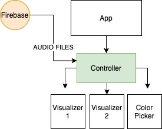

<h1 align="center">// Screen Mosh \\</h1>

Authored by Max Brockabnk

Updated on Feb 26, 2021

# Description
Screen Mosh is an audio visualizer built in react, with the music stored in a Firbase NoSQL database. Choose a song to listen to and watch some crazy animations happen!

## Required Technologies
* Modern Web Browser
* Text Editor
* NodeJS / NPM

## Set-up Instructions
1. Click on the green `Code` button and copy the URL that shows up.
2. Open up your computer's terminal and navigate to the desktop directory `cd Desktop` or any other directory you'd like the project to live in. 
3. Open this project in your text editor.
4. In the terminal navigate to the project's root directory and install node_modules with the command `npm i`.
5. Finally to build and start the development server and view the project run the command `npm start`.

## Technologies Used
* JavaScript
* React / JSX
* React-Bootstrap
* CSS
* Redux / React Redux
* Firebase / Firestore

## Component Diagram

## Known Bugs

## Legal
* Copyright © 2020 Max Brockbank
* This software is licensed under the MIT license
In the project directory, you can run:

### `npm start`

Runs the app in the development mode.\
Open [http://localhost:3000](http://localhost:3000) to view it in the browser.

The page will reload if you make edits.\
You will also see any lint errors in the console.

### `npm test`

Launches the test runner in the interactive watch mode.\
See the section about [running tests](https://facebook.github.io/create-react-app/docs/running-tests) for more information.

